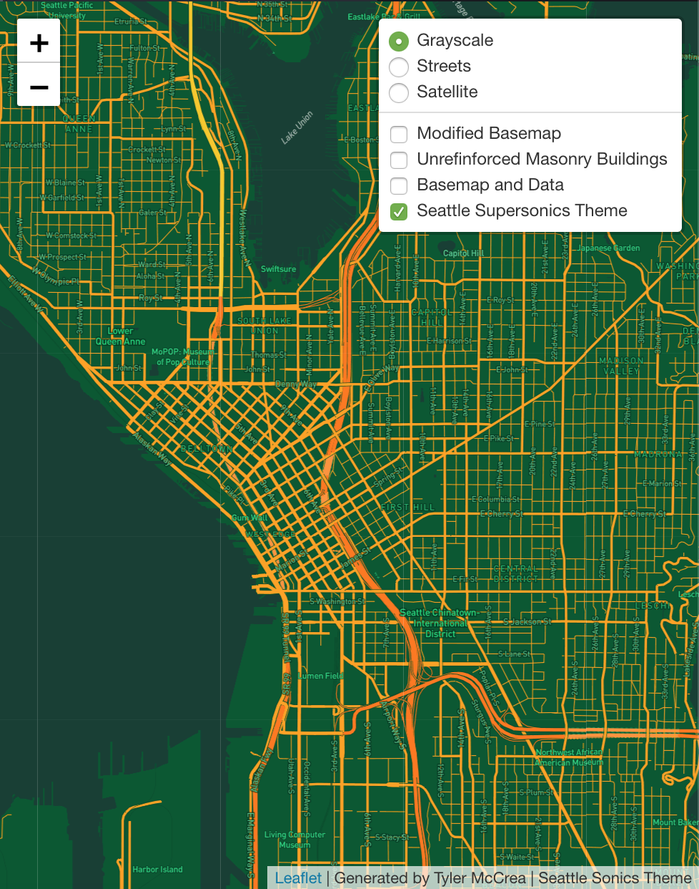

# GEOG458_Lab4 (Example Deliverable)

This is an example deliverable for GEOG 458 - Lab 4: Generating Map Tiles

Your repository should include: 

- index.html: hosting web map
- assets folder: containing the map tile files
- img folder: containing map screenshots

You should also include a screenshot of each of your tiles, and include a description of the tile, the geographic area, and the zoom levels set for the tile. 

## Tile 1 Screenshot - Modified Basemap

## Tile 2 Screenshot - Map Data (Unreinforced Masonry Buildings, Seattle)

## Tile 3 Screenshot - Basemap and Data 

## Tile 4 Screenshot - Seattle Supersonics Theme

